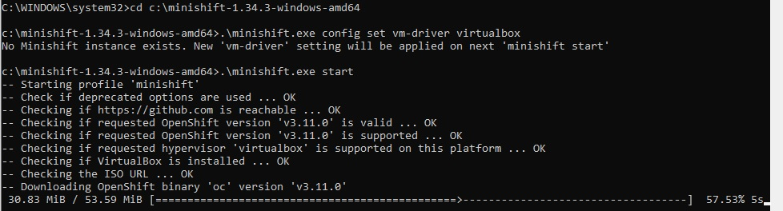
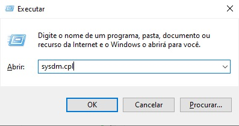
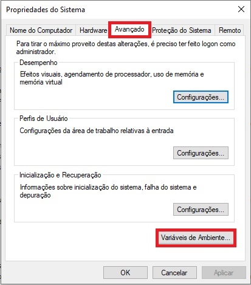
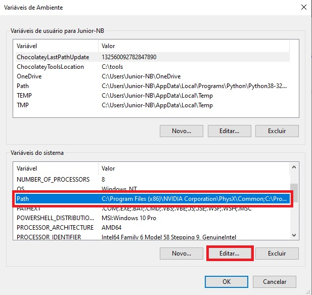
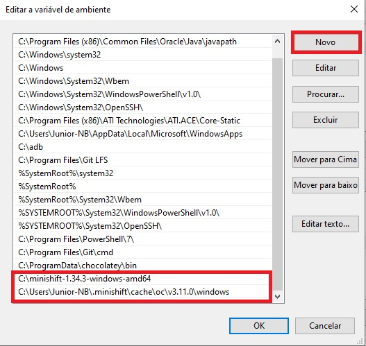
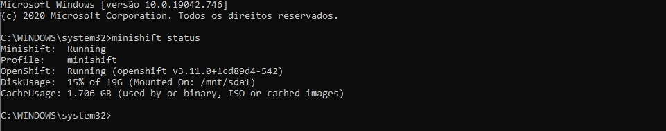
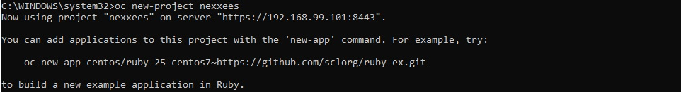
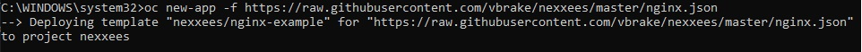
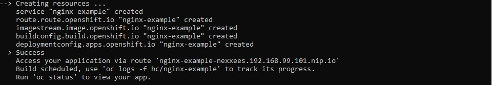
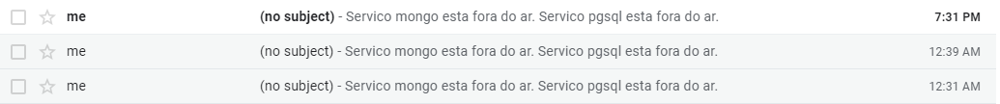

# Questão 1

De acordo com os requisitos, penso que o ponto chave seria verificar a integridade do arquivo que é enviado ao servidor FTP. Um acordo com a fábrica de software para envio de um md5 junto do arquivo traria maior credibilidade ao deploy e evitaria erros esotéricos. Como a parte do build não depende de nós, penso que um script que verificasse novos arquivos no ftp, junto do seu md5 (caso possível), seria suficiente.
O deploy poderia ser feito com um mero acesso via ssh a máquina de destino, junto com o comando para sua execução. Tanto a verificação quanto a execução poderia ser realizada com um shell script, hospedado em servidor local ou em um container que tivesse acesso a ambas as pontas. Possíveis erros no deploy poderiam e devem ser enviados via alerta a um email para a equipe de desenvolvimento.

# Questão 2
> Procedimentos realizados em uma máquina Windows 10 com o Virtual Box. O procedimento é semelhante caso use uma distribuição linux com Virtual Box.

1. Instale o VirtualBox na máquina ( https://www.virtualbox.org/wiki/Downloads ).

2. Baixe o minishift ( https://github.com/minishift/minishift/releases ) e descompacte-o na raiz do seu drive ou diretório de sua preferência. 

3. Execute o prompt de comando ou powershell como administrador. 
No Windows, isso pode ser feito apertando o botão Windows + R, depois digitando cmd e apertando ctrl+shift+enter.

4. Com o terminal aberto, execute os comandos abaixo. Por exemplo, caso tenha descompactado na raiz do drive C:
```
cd c:\minishift-1.34.3-windows-amd64
.\minishift.exe config set vm-driver virtualbox
.\minishift.exe start
```



> O processo pode demorar um bom tempo para ser finalizado. Após término, a plataforma minishift estará instalada.

5. Para facilitar os comandos a seguir, é necessário adicionar os comandos minishift e oc no PATH do Windows. Abra novamente a janela de executar com o botão Windows + R e digite `sysdm.cpl`. 



Na janela a seguir, clique na aba `Avançado` e depois em `Variáveis de Ambiente`.



Na janela `Variáveis do Sistema`, clique na linha PATH e depois em editar.



Clique em Novo e adicione o diretório do minishift e do oc. A imagem abaixo mostra um exemplo dos dois diretórios adicionados. Para o diretório do executável oc, não se esqueça de trocar para o seu usuário:



6. Abra um novo terminal como administrador e verifique se os caminhos foram adicionados corretamente. 
Ao digitar minishift status, ele deve retornar informações sobre o minishift.



7. Crie um novo projeto. Por exemplo, para se criar um projeto com o nome nexxees, execute o comando a seguir:
`oc new-project nexxees`



8. Crie uma nova aplicação utilizando o json a seguir. Ela foi criada usando como base o exemplo do projeto do nginx no minishift, com as variáveis trocadas para o repositório atual:
`oc new-app -f https://raw.githubusercontent.com/vbrake/nexxees/master/nginx.json`



9. Ao final da criação, aparecerá no terminal uma url. O arquivo json pedido pela questão pode ser acessado digitando /nexxees.json ao final da url. Por exemplo, caso a url retornada seja a da imagem abaixo:



De acordo com a imagem acima, ao acessarmos http://nginx-example-nexxees.192.168.99.101.nip.io/nexxees.json, veremos o json requisitado.

# Questão 3

Foi criado um script em python que verifica se a url está no ar, e caso esteja, envia um email para alertanxs@gmail.com, dizendo quais serviços estão fora do ar. O script está disponível neste repositório com o nome `verifica-disponbilidades.py`. Ele deve ser executado da mesma máquina que executou o minishift. Abaixo segue um exemplo do script em ação:
```
PS C:\Users\Junior-NB\Documents\nexxees> py.exe .\verifica-disponibilidades.py
Email enviado com sucesso para alertanxs@gmail.com
PS C:\Users\Junior-NB\Documents\nexxees>
```


